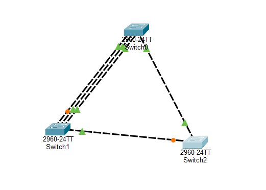
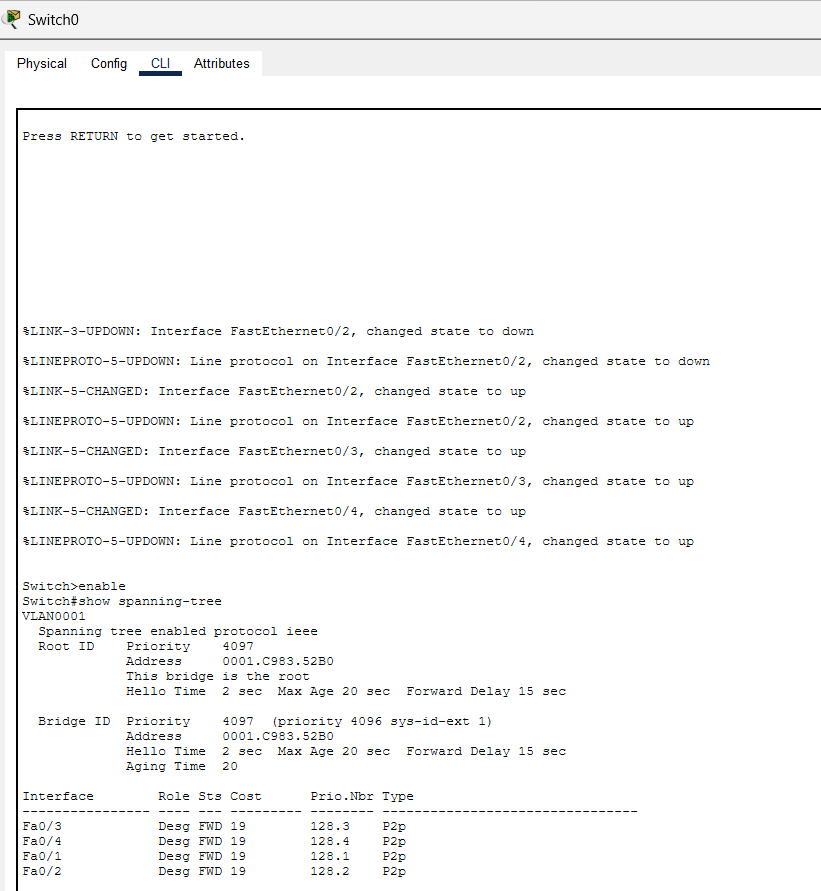

# Lab-5-STP-LACP-EtherChannel
Cisco Packet Tracer lab demonstrating STP root bridge election, redundant path failover, and LACP EtherChannel configuration.
# Lab 5 – STP & LACP EtherChannel

## Objective

The objective of this lab was to configure and analyze Spanning Tree Protocol (STP) and LACP EtherChannel in a redundant Layer 2 switched network.

The lab demonstrates STP root bridge election, port roles, path-cost selection, link failover, EtherChannel configuration, LACP negotiation, and physical-link redundancy.

---

## Network Topology

The topology consists of three Cisco 2960 switches connected in a redundant triangle.

```text
              Switch0
             /       \
            /         \
       Switch1 ------- Switch2
```

The redundant topology provides multiple Layer 2 paths while STP prevents switching loops.




---

## STP Root Bridge Election

Initially, all three switches used the default STP priority.

Because the priorities were equal, STP used the lowest MAC address as the tiebreaker when electing the Root Bridge.

The STP election rule is:

```text
Lowest Bridge ID wins.

Bridge ID = Bridge Priority + MAC Address
```

Switch0 was later manually configured as the Root Bridge using:

```text
configure terminal
spanning-tree vlan 1 priority 4096
end
```

Verification:

```text
show spanning-tree
```

The effective VLAN 1 priority appeared as `4097` because the VLAN ID is included as the extended system ID.




---

## STP Port Roles

After Switch0 became the Root Bridge, STP calculated a loop-free topology.

The following port roles were observed:

```text
Root Port       = Best path toward the Root Bridge
Designated Port = Forwarding port for a network segment
Alternate Port  = Redundant path placed into blocking state
```

Example:

```text
Fa0/1   Root   FWD
Fa0/2   Altn   BLK
```

This demonstrated how STP prevents Layer 2 loops while maintaining a redundant backup path.

---

## STP Failover Test

A failure was simulated by shutting down Switch1's Root Port:

```text
configure terminal
interface fa0/1
shutdown
end
```

Before the failure:

```text
Fa0/1   Root FWD
Fa0/2   Altn BLK
```

After the failure, STP recalculated the topology:

```text
Fa0/2   Root FWD
```

The alternate path became the new forwarding path to the Root Bridge.

The path cost also changed from `19` to `38` because traffic now traveled through an additional switch.


---

## LACP EtherChannel

Two physical links between Switch0 and Switch1 were bundled into one logical EtherChannel.

Interfaces:

```text
Fa0/3
Fa0/4
```

LACP configuration:

```text
configure terminal
interface range fa0/3 - 4
channel-group 1 mode active
end
```

The configuration was applied to both switches.

LACP `active` mode allows the switches to actively negotiate formation of the EtherChannel.

---

## EtherChannel Verification

EtherChannel operation was verified using:

```text
show etherchannel summary
```

Successful output included:

```text
Po1(SU)       LACP       Fa0/3(P) Fa0/4(P)
```

Where:

```text
Po1 = Port-Channel 1
S   = Layer 2
U   = In use
P   = Bundled in Port-Channel
```


---

## STP and EtherChannel Integration

After EtherChannel formed, STP treated the physical interfaces as one logical interface:

```text
Po1
```

STP selected Po1 as the Root Port because its path cost was lower than the individual FastEthernet connection.

```text
Fa0/1   Altn BLK   Cost 19
Po1     Root FWD   Cost 12
```

This demonstrated that EtherChannel does not replace STP. STP continues operating but evaluates the Port-Channel as a single logical Layer 2 interface.


---

## EtherChannel Failure Test

One EtherChannel member was intentionally shut down:

```text
interface fa0/3
shutdown
```

Verification showed:

```text
Po1(SU)    LACP    Fa0/3(D) Fa0/4(P)
```

Although Fa0/3 was down, Port-Channel 1 remained operational through Fa0/4.

This demonstrated EtherChannel link redundancy: failure of one physical member does not necessarily cause the logical Port-Channel to fail.

---

## Key Commands

```text
show spanning-tree
show etherchannel summary

spanning-tree vlan 1 priority 4096

interface range fa0/3 - 4
channel-group 1 mode active

interface fa0/3
shutdown
no shutdown

copy running-config startup-config
```

---

## Key Takeaways

- STP prevents Layer 2 switching loops.
- The switch with the lowest Bridge ID becomes the Root Bridge.
- Bridge priority is evaluated before MAC address.
- When priorities tie, the lowest MAC address wins.
- A non-root switch selects its Root Port based on the lowest path cost to the Root Bridge.
- Alternate ports provide redundant paths and may remain blocked until needed.
- STP can reconverge when an active network path fails.
- EtherChannel combines multiple physical links into one logical Port-Channel.
- LACP dynamically negotiates EtherChannel membership.
- STP treats an EtherChannel as one logical interface.
- EtherChannel provides additional bandwidth and link redundancy.
- A Port-Channel can remain operational when one member link fails.

---

## Skills Demonstrated

`Spanning Tree Protocol` `STP` `LACP` `EtherChannel` `Port-Channel` `Layer 2 Redundancy` `Root Bridge Election` `STP Path Cost` `Network Failover` `Cisco IOS` `Packet Tracer` `Network Troubleshooting`
